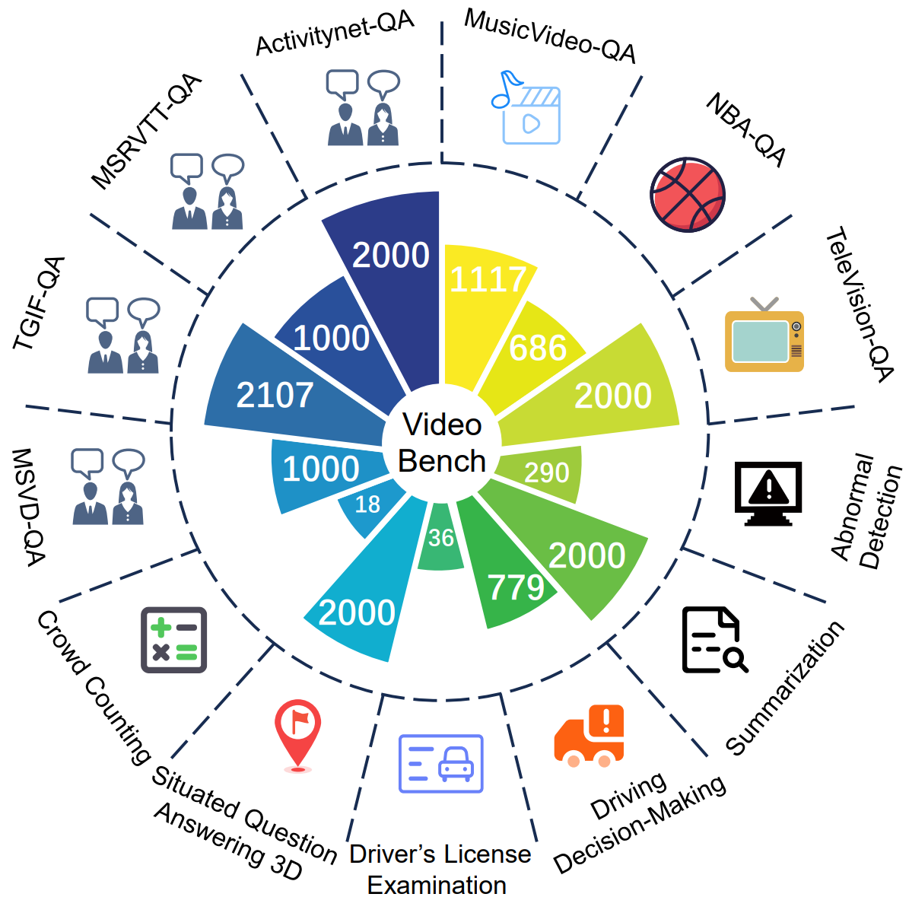

[Arxiv](https://arxiv.org/abs/2311.16103)
<p align="center">
    
<p> 
<h2 align="center"> <a href="https://arxiv.org/abs/2311.16103">Video-Bench: A Comprehensive Benchmark and Toolkit for Evaluating Video-based Large Language Models</a></h2>
<h5 align="center"> If you like our project, please give us a star ⭐ on GitHub for latest update.  </h2>

 
<h5 align="center">
    
[](https://huggingface.co/spaces/LanguageBind/Video-Bench)
[](https://arxiv.org/abs/2311.16103)
[](https://github.com/PKU-YuanGroup/Video-Bench/blob/main/LICENSE) 
[](https://hits.seeyoufarm.com)
[](https://github.com/PKU-YuanGroup/Video-Bench/issues?q=is%3Aopen+is%3Aissue)
[](https://github.com/PKU-YuanGroup/Video-Bench/issues?q=is%3Aissue+is%3Aclosed)  <br>
<!--[](https://zhuanlan.zhihu.com/p/668166885)-->

</h5>
 

* **We introduce Video-Bench, the first comprehensive evaluation benchmark for Video-LLMs, featuring a three-level ability assessment that systematically evaluates models in video-exclusive understanding, prior knowledge incorporation, and video-based decision-making abilities.**
* **We provide a user-friendly evaluation toolkit. Accompanied by our datasets and QA pairs, the toolkit can streamline the performance assessment of Video-LLMs.**
* **We conduct extensive experiments to evaluate prominent Video-LLMs, summarizing their behaviors, analyzing main causes for observed limitations, and proposing future directions for improvement.**


## 📰 News
**[2023.11.27]** Video-Bench is released! Data and evaluation code is available now.

## 📣 Leaderboard
Welcome to [**Video-Benchmark Leaderboard**](https://huggingface.co/spaces/LanguageBind/Video-Bench)!

🚩🚩🚩 We are delighted to have witnessed the remarkable advancements in video understanding and artificial intelligence alongside the community over the past year. We are proud to announce the launch of Video-Bench, a platform designed to assist developers and users in the field of video analysis.

🔥🔥🔥  Video-Bench is committed to promoting the progress of video understanding models and facilitating their evaluation. We are pleased to announce the inaugural Video-Bench Leaderboard. This leaderboard aims to systematically evaluate the performance of video understanding models across various capabilities, including **Prior Knowledge based QA, Comprehension Decision-making, Video-exclusive Understanding,** and more.
The leaderboard will feature rankings for open-source models, providing an inclusive and comprehensive reference for the industry and research community. We invite developers and researchers working on video understanding models to join Video-Bench and showcase their models' performance advantages in different domains.

👋👋👋 We also welcome valuable suggestions and contributions from the community to foster collaborative growth and advancement in video understanding models. If you have any questions or would like to get involved, please feel free to contact us. Let's eagerly anticipate the release of the Video-Bench Leaderboard and the continued progress in video understanding and artificial intelligence!

## 🤗 Evaluation

1. Clone this repository and navigate to Video-Bench folder
```bash
git clone https://github.com/PKU-YuanGroup/Video-Bench.git
cd Video-Bench

```
2. Install additional packages
```bash
pip install -r requirements.txt
```
### 📂 Data Preparation
The video data can easily be downloaded from [Huggingface](https://huggingface.co/datasets/LanguageBind/Video-Bench) 

### 🏗️ Evaluate your own model
The code below is just a generalized framework for dataset evaluation, you will need to refine the model loading part according to your own model. Once the code execution is complete, you will find some JSON files named `./Chat_results/{dataset_name}.json`. 

**Step1: Chat with your own model to obtain conversation results.**
```python
import argparse
import os
import json

parser = argparse.ArgumentParser()
parser.add_argument("--dataset_name", type=str, default=None, help="The type of LLM")
parser.add_argument("--Eval_QA_root", type=str, default='./', help="folder containing QA JSON files")
parser.add_argument("--Eval_Video_root", type=str, default='./', help="folder containing video data")
parser.add_argument("--chat_conversation_output_folder", type=str, default='./Chat_results', help="")
args = parser.parse_args()

Eval_QA_root = args.Eval_QA_root
Eval_Video_root = args.Eval_Video_root
dataset_qajson = {
  "Ucfcrime": f"{Eval_QA_root}/Eval_QA/Ucfcrime_QA_new.json",
  "Youcook2": f"{Eval_QA_root}/Eval_QA/Youcook2_QA_new.json",
  "TVQA": f"{Eval_QA_root}/Eval_QA/TVQA_QA_new.json",
  "MSVD": f"{Eval_QA_root}/Eval_QA/MSVD_QA_new.json",
  "MSRVTT": f"{Eval_QA_root}/Eval_QA/MSRVTT_QA_new.json",
  "Driving-decision-making": f"{Eval_QA_root}/Eval_QA/Driving-decision-making_QA_new.json",
  "NBA": f"{Eval_QA_root}/Eval_QA/NBA_QA_new.json",
  "SQA3D": f"{Eval_QA_root}/Eval_QA/SQA3D_QA_new.json",
  "Driving-exam": f"{Eval_QA_root}/Eval_QA/Driving-exam_QA_new.json",
  "MV": f"{Eval_QA_root}/Eval_QA/MV_QA_new.json",
  "MOT": f"{Eval_QA_root}/Eval_QA/MOT_QA_new.json",
  "ActivityNet": f"{Eval_QA_root}/Eval_QA/ActivityNet_QA_new.json",
  "TGIF": f"{Eval_QA_root}/Eval_QA/TGIF_QA_new.json"
}

if args.dataset_name is None:
    dataset_name_list = list(dataset_qajson.keys())
else:
    dataset_name_list = [args.dataset_name]
    print(f'Specifically run {args.dataset_name}')
print(dataset_name_list)

os.makedirs(args.chat_conversation_output_folder, exist_ok=True)

for dataset_name in dataset_name_list:
    qa_json = dataset_qajson[dataset_name]
    print(f'Dataset name:{dataset_name}, {qa_json=}!')
    with open(qa_json, 'r', encoding='utf-8') as f:
        data = json.load(f)
        
    eval_dict = {}
    for idx, (q_id, item) in enumerate(data.items()):
        try:   
            video_id = item['video_id']
            question = item['question'] 
            answer_ = item['answer']
            if len(item['choices']) == 6:
                question += f"Choices: A.{item['choices']['A']} B.{item['choices']['B']} C.{item['choices']['C']} D.{item['choices']['D']} E.{item['choices']['E']} F.{item['choices']['F']} \n Among the six options A, B, C, D, E, F above, the one closest to the correct answer is:"
                candidates = ['A', 'B', 'C', 'D', 'E', 'F']
                candidates_long = [f" A.{item['choices']['A']}", f"B.{item['choices']['B']}", f"C.{item['choices']['C']}", f"D.{item['choices']['D']}", f"E.{item['choices']['E']}", f"F.{item['choices']['F']}"]
            elif len(item['choices']) == 5:
                question += f" A.{item['choices']['A']} B.{item['choices']['B']} C.{item['choices']['C']} D.{item['choices']['D']} E.{item['choices']['E']} \n Among the five options A, B, C, D, E above, the one closest to the correct answer is: "
                candidates = ['A', 'B', 'C', 'D', 'E']
                candidates_long = [f" A.{item['choices']['A']}", f"B.{item['choices']['B']}", f"C.{item['choices']['C']}", f"D.{item['choices']['D']}", f"E.{item['choices']['E']}"]
            elif len(item['choices']) == 4:
                question += f" A.{item['choices']['A']} B.{item['choices']['B']} C.{item['choices']['C']} D.{item['choices']['D']} \n Among the four options A, B, C, D above, the one closest to the correct answer is:"
                candidates = ['A', 'B', 'C', 'D']
                candidates_long = [f" A.{item['choices']['A']}", f"B.{item['choices']['B']}", f"C.{item['choices']['C']}", f"D.{item['choices']['D']}"]
            elif len(item['choices']) == 3:
                question += f" A.{item['choices']['A']} B.{item['choices']['B']} C.{item['choices']['C']} \n Among the three options A, B, C above, the one closest to the correct answer is: "
                candidates = ['A', 'B', 'C']
                candidates_long = [f" A.{item['choices']['A']}", f"B.{item['choices']['B']}", f"C.{item['choices']['C']}"]
            elif len(item['choices']) == 2:
                question += f" A.{item['choices']['A']} B.{item['choices']['B']} \n Among the two options A, B above, the one closest to the correct answer is: "
                candidates = ['A', 'B']
                candidates_long = [f" A.{item['choices']['A']}", f"B.{item['choices']['B']}"]
            vid_rela_path = item['vid_path']
            vid_path = os.path.join(Eval_Video_root, vid_rela_path)


            #=================================You need to change this code =========================
            # ......
            output, output_scores = ask(args, question, model, tokenizer, image_processor, vid_path)
            # ......
            #=======================================================================================

            eval_dict[q_id] = {
                'video_id': video_id,
                'question': question,
                'output_sequence': output,
                'correct': answer_
            }  
            print(f'q_id:{q_id}, output:{output}, correct answer:{answer_}!\n')
        except Exception as e:
            traceback.print_exc()  
    # eval results
    eval_dataset_json = f'{args.chat_conversation_output_folder}/{dataset_name}_eval.json'
    with open(eval_dataset_json, 'w', encoding='utf-8') as f:
        json.dump(eval_dict, f, indent=2)

```

After obtaining the `./Chat_results/{dataset_name}.json` files, you can utilize ChatGPT or T5 model as experts to assess the correctness of the model's output answer. The specific code is as follows:

**Step2: Evaluate your model's answer and obtain final scores across 13 datasets**
#### ChatGPT Evaluation
```python 
python Step2_chatgpt_judge.py  --model_chat_files_folder ./Chat_results  \
--apikey sk-eionFWpNThMNy4eeFdC25789F60a4cC2A66b2cxxxxxxx \
--chatgpt_judge_output_folder  ./ChatGPT_Judge
```

```python
python Step3_compute_scores.py  --chatgpt_judge_output_folder ./ChatGPT_Judge \
--score_output_file ./Final_score_table_ChatGPT.csv
```

#### T5 Evaluation
```python
python Step2_T5_judge.py  --model_chat_files_folder  ./Chat_results \
--T5_judge_output_folder  ./T5_Judge  \
--Eval_QA_root  ./ 
```

```python
python Step3_compute_scores_T5.py  --T5_judge_files_folder  ./T5_Judge \
--score_output_file  ./Final_score_table_T5.csv
```

After you get the `Final_score_table.csv` file, you can submit this file to [Video-Bench leaderboard](https://huggingface.co/spaces/LanguageBind/Video-Bench) compare with other models!

## 🐳  License
Video-Bench is released under Apache License Version 2.0.
